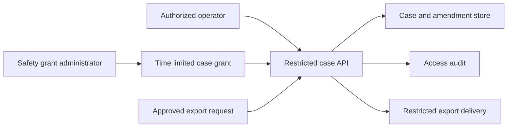

# Restricted safety and care-continuity records

Status: proposed SAFETY-01 design. This document defines the boundary that a
future implementation must satisfy. It creates no record type, route, role,
export, retention worker, or pilot claim. Issue #56 remains open.

The owner promoted issues #50–71 for source work. That authorizes this design.
It does not supply the purpose, retention, oversight, pilot, or operating
evidence needed to store restricted records.

## Purpose and non-goals

A restricted record may support a local, need-to-know response to an event
safety concern or a care-continuity need. A workspace must state the purpose
before it creates a record. The purpose is the reason for collecting,
accessing, correcting, retaining, or exporting the record.

The feature is not a reputation system. It must not create a public profile,
AT Protocol record, global lookup, cross-workspace history, risk score, or
automated punitive action. A record must not change a person's membership,
admission, staffing, payment, or publishing authority. A separately authorized
operational decision may refer to reviewed evidence, but that decision needs
its own actor, reason, authority, and review path.

This boundary follows [ADR 0003](../adr/0003-no-global-reputation.md) and the
private-projection rule in [data boundaries](data-boundaries.md).

## Proposed record boundary

Each case belongs to one workspace and may reference one event. It has an
opaque local identifier. A case is not a person profile and must not be
searchable outside its authorized workspace context.

The first implementation should support a small, owner-approved category set.
Possible categories include a safety concern, a care accommodation follow-up,
or an operational follow-up. A category is not a claim about a person.

The data model must collect the minimum facts needed for that reason:

- the case category and stated purpose;
- an optional event reference;
- a report time and, when known, an occurrence time with an explicit precision
  or uncertainty marker;
- a source class such as direct report, witness report, organizer observation,
  or supplied external material;
- a restricted narrative and a restricted follow-up state;
- creation and amendment provenance; and
- a policy-selected review or expiry time.

The initial model must exclude diagnoses, identity documents, immigration
status, generalized behavioural labels, speculative motive, unrelated
third-party contact details, and bulk attachments. Any later category or data
type needs a separate purpose, access, retention, and export review.

An unverified report remains an attributed report. The record must not present
it as established fact. A correction or outcome is a separate amendment with
its own actor, time, source, and reason. The original report must not be
silently overwritten. A correction does not require the product to decide that
an allegation was true or false.

## Access, provenance, correction, and export

Existing workspace roles are not narrow enough by themselves. In the current
authority matrix, `owner` has every current permission and `organizer` has
broad daily-operation permissions. A future safety capability must therefore
use a dedicated safety-grant model. Grant administration and case reading must
be separate actions. A person who can grant or revoke access does not thereby
need access to every case.

A grant should name the workspace, person, permitted action, optional case
scope, grantor, expiry, and revocation provenance. The implementation must
recheck both active workspace membership and the active safety grant for every
case read, mutation, correction, export request, export approval, and export
retrieval. The existing `activeMembership` and `requirePermission` patterns in
[authority.go](../../backend/internal/app/authority.go) provide the current
revocation and expiry model. They do not implement safety grants.

Case events require actor, action, subject, and time provenance. Generic
`audit_entries.metadata` must contain identifiers and decision metadata only.
It must never contain the restricted narrative, a copied report, or an export
payload. This follows [audit.go](../../backend/internal/app/audit.go) and the
privacy audit's logging boundary. Request logs must continue to contain route
templates,
status, and duration rather than record identifiers, query values, or bodies.

Exports are disabled until an explicit workflow is approved. A proposed
controlled export has one case, a stated purpose, a named recipient, a
redaction profile, an approval record, an expiry, and a single retrieval.
It must produce a non-narrative audit receipt. It must not use an email
attachment or an announcement channel. The owner must decide whether a second
approver is required for every export, particular categories, or neither.

## Retention and key boundary

No default retention period is set here. The operator must choose a review
period, an expiry or de-identification outcome, a legal-hold policy if one is
needed, and the accountable role before data collection begins. A UI reminder
alone is not retention enforcement.

Restricted content and any sensitive subject linkage need a separate encryption
boundary with key version provenance. A future implementation must not reuse
the identity-protection key solely because that key already encrypts identity
material. The operating design must identify the key source, grant access to
the key separately from ordinary application access, and test recovery without
printing live sensitive content. Backups remain a privileged data path. The
existing [data lifecycle](data-lifecycle.md) document describes the current
limits: no dedicated incident table, export endpoint, deletion endpoint, or
retention worker exists today.

## Threats and required controls

| ID | Abuse path | Priority | Required control before implementation |
| --- | --- | --- | --- |
| TM-01 | A legitimate owner or organizer browses cases to retaliate against a reporter or subject. | High | Separate grant administration from read access. Use time-limited case grants, recheck authorization on every action, and log reads and exports. Decide oversight and export approval before collecting records. |
| TM-02 | An unverified report becomes a durable label that influences unrelated operational decisions. | High | Keep source and report status explicit. Use append-only corrections. Prohibit automatic enforcement, reputation fields, and cross-workspace sharing. |
| TM-03 | A case leaks through a public DTO, generic audit metadata, logs, errors, search, or an export route. | High | Use isolated tables and allowlisted DTOs. Add privacy sentinels to public, authenticated, error, log, and export tests. Never put narrative content in generic audit metadata. |
| TM-04 | A revoked, expired, or cross-workspace user reads or exports a case. | High | Scope every case and grant by workspace. Recheck active membership and the grant at read, mutation, export generation, and retrieval. Test UUID substitution and revocation between authorization and delivery. |
| TM-05 | An export reaches an unintended recipient or remains usable after access changes. | High | Keep export disabled until approved. Bind an export to a named recipient and purpose. Use a short-lived single retrieval and revoke pending retrieval on grant revocation. |
| TM-06 | A database, backup, or deployment operator reads restricted material outside the API authorization boundary. | High | Separate encryption keys and recovery authority from normal application access. Qualify backup restoration and key recovery. Define an operating escalation path. |
| TM-07 | A reporter, subject, or staff member cannot understand or correct a record about them. | Medium | Choose a correction and dispute process before collection. Preserve amendments and decision provenance without treating disputes as a score or a fact finding. |

The current privacy audit covers existing public routes, logging, and selected
private fields. It does not cover a safety-record implementation. Re-run that
audit when a case, grant, export, worker, or operator UI path exists.

## Acceptance mapping and implementation gates

| Issue #56 acceptance criterion | Proposed evidence before code | Implementation gate |
| --- | --- | --- |
| Purpose, categories, minimal retention, and narrow roles | Owner decisions recorded in this document's companion decision record. | Selected categories, retention outcome, accountable operator, and grant policy. |
| Actor, time, provenance, controlled export, and corrections | Data and API contract with tests for append-only amendments and authorization. | Dedicated schema, restricted DTOs, safety grants, export workflow, and audit receipts. |
| Retaliation, allegations, and accidental sharing threat model | TM-01 through TM-07 reviewed against the actual implementation. | Privacy sentinel, authorization, revocation, export, logging, recovery, browser, and device evidence. |
| No public reputation or automated punitive scoring | ADR and testable negative scope statement. | No public projection, global lookup, score, or automatic enforcement path. |

## Owner decisions and remaining evidence

Before implementation, the owner must decide the concrete purpose and
controller, permitted categories and intake sources, safety-grant and export
oversight, correction and dispute process, retention and any hold policy, and
key-recovery ownership. The owner must also identify the pilot need, privacy or
rights review, named responders, and capacity to handle access or correction
requests.

Before a deployment claim, qualify the chosen policy with disposable PostgreSQL
integration tests, browser and device evidence for restricted views, an export
and revocation journey, backup and key-recovery evidence, and an operator
runbook. Pilot evidence remains separate. Neither this design nor local tests
prove that a live team can safely operate the feature.
